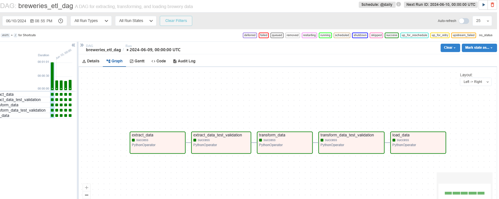

# ETL Data Pipeline para Dados de Clima e Tráfego

## Descrição
Este projeto extrai dados de clima da API OpenWeatherMap e dados de tráfego da API OSRM, transforma e limpa os dados, e os carrega em um banco de dados PostgreSQL. Em seguida, são executadas consultas para gerar relatórios baseados nos dados extraídos.

## Configuração

### Pré-requisitos
- Git
- Docker
- Docker Compose

### Variáveis de Ambiente
Defina as variáveis de ambiente para as chaves das APIs nos arquivos `docker-compose`. Obtenha suas chaves de API em:
- [API OpenWeatherMap](https://home.openweathermap.org/api_keys)
- [API OSRM](https://project-osrm.org/)

### Passos para Executar

1. Defina as variáveis de ambiente para as chaves das APIs nos arquivos `docker-compose` (https://home.openweathermap.org/api_keys)

2. Clone o repositório:
    ```bash
    git clone https://github.com/vitorjpc10/etl-weather_traffic_data.git
    ```
3. Acesse o repositório recém-clonado:
    ```bash
    cd etl-weather_traffic_data
    ```

### ETL sem Orquestrador (Docker Python)

4. Construa e execute os contêineres Docker:
    ```bash
    docker-compose up --build
    ```

5. Os dados serão extraídos, transformados e carregados no banco de dados PostgreSQL com base na lógica em `scripts/main.py`.

6. Após a construção, execute o seguinte comando para executar consultas nas tabelas de clima e tráfego:
    ```bash
    docker exec -it etl-weather_traffic_data-db-1 psql -U postgres -c "\i queries/queries.sql"
    ```

   Digite `\q` no terminal para sair da consulta, há 2 consultas no total.

7. Para gerar o relatório pivotado, acesse o banco de dados PostgreSQL e execute o arquivo SQL `query.sql`:
    ```bash
    docker exec -it etl-gdp-of-south-american-countries-using-the-world-bank-api-db-1 psql -U postgres -c "\i query.sql"
    ```

### ETL com Orquestrador (Apache Airflow)

4. Acesse o diretório do Airflow:
    ```bash
    cd airflow
    ```

5. Construa e execute os contêineres Docker:
    ```bash
    docker-compose up --build
    ```

6. Após todos os contêineres serem construídos, acesse o Airflow localmente (http://localhost:8080/) e acione o DAG `etl_dag` (o nome de usuário e a senha são admin por padrão).

7. Após a compilação bem-sucedida do DAG, execute o seguinte comando para executar consultas nas tabelas de clima e tráfego:
    ```bash
    docker exec -it etl-weather_traffic_data-db-1 psql -U airflow -c "\i queries/queries.sql"
    ```
   Digite `\q` no terminal para sair da consulta, há 2 consultas no total.

## Pressupostos e Decisões de Design
- O projeto usa Docker e Docker Compose para a conteinerização e orquestração para garantir ambientes consistentes de desenvolvimento e implantação.
- Volumes do Docker são utilizados para persistir os dados do PostgreSQL, garantindo que os dados permaneçam intactos mesmo que os contêineres sejam interrompidos ou removidos.
- O banco de dados PostgreSQL é selecionado para armazenamento de dados devido à sua confiabilidade, escalabilidade e suporte a consultas SQL.
- Pure Python, SQL e PySpark são usados para manipulação de dados para garantir processamento leve e eficiente.
- As consultas SQL para gerar relatórios são armazenadas em arquivos separados (por exemplo, `queries.sql`). Isso permite a fácil modificação das consultas e fornece uma maneira conveniente de visualizar os resultados.
- Para gerar os relatórios, as consultas SQL são executadas dentro do contêiner do banco de dados PostgreSQL. Essa abordagem simplifica o processo e garante que as consultas possam ser facilmente executadas e modificadas conforme necessário.

## Exemplo de DAG do Airflow

