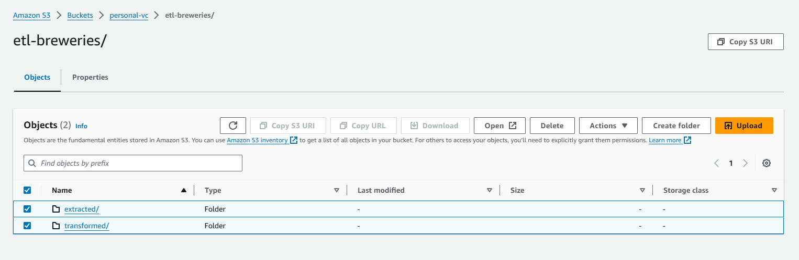

# Pipeline de Dados ETL para Dados de Cervejarias

### O readme em português está disponível aqui: [README-PT](README-PT.md)

## Descrição
1. Este projeto extrai dados de cervejarias do endpoint da API <https://api.openbrewerydb.org/breweries>.
2. Transforma, limpa os dados e persiste os dados nos formatos json e parquet, incluindo uma visualização agregada com a quantidade de cervejarias por tipo e localização.
3. Carrega os dados no banco de dados PostgreSQL para capacidades adicionais de consulta.

## Configuração

### Variáveis de Ambiente

1. Defina as variáveis de ambiente das Chaves da AWS nos arquivos docker-compose para escrever os dados no Armazenamento S3. 
2. Localização do Bucket S3 para Gravar Arquivos do Data Lake
**(Opcional)**

__Se não forem definidas, os dados ainda serão escritos localmente no contêiner, mas a escrita de dados no armazenamento em nuvem S3 será ignorada.__

### Pré-requisitos
- Git
- Docker
- Docker Compose

### Passos para Executar

1. Clone o repositório:
    ```bash
    git clone https://github.com/vitorjpc10/etl-breweries.git
    ```
2. Mova-se para o repositório recém-clonado:
    ```bash
    cd etl-breweries
    ```

### ETL sem Orquestrador (Imagem Docker Python)

3. Construa e execute os contêineres Docker:
    ```bash
    docker-compose up --build
    ```

4. Os dados serão extraídos, transformados e carregados no banco de dados PostgreSQL com base na lógica em `scripts/main.py`.

5. Depois de construídos, execute o seguinte comando para executar consultas nas tabelas de clima e tráfego do contêiner do banco de dados PostgreSQL:
    ```bash
    docker exec -it etl-breweries-db-1 psql -U postgres -c "\i queries/queries.sql"
    ```

   Use `\q` no terminal para sair da consulta, há 2 consultas no total.

### ETL com Orquestrador (Apache Airflow)

4. Mova-se para o diretório Airflow:
    ```bash
    cd airflow
    ```

5. Construa e execute os contêineres Docker:
    ```bash
    docker-compose up airflow-init --build
    ```
   ```bash
    docker-compose up
    ```

6. Depois que todos os contêineres forem construídos, acesse localmente (http://localhost:8080/) e acione a DAG etl_dag (o nome de usuário e a senha são admin por padrão).

7. Depois que a DAG for compilada com sucesso, execute o seguinte comando para executar consultas nas tabelas de clima e tráfego:
    ```bash
    docker exec -it airflow-postgres-1 psql -U airflow -c "\i queries/queries.sql"
    ```
   Use `\q` no terminal para sair da consulta, há 2 consultas no total.


## Suposições e Decisões de Design
- O projeto usa Docker e Docker Compose para containerização e orquestração para garantir ambientes de desenvolvimento e implantação consistentes.
- Volumes Docker são utilizados para persistir dados do PostgreSQL, garantindo que os dados permaneçam intactos mesmo se os contêineres forem interrompidos ou removidos.
- O banco de dados PostgreSQL é selecionado para armazenamento de dados devido à sua confiabilidade, escalabilidade e suporte para consultas SQL.
- Python puro, SQL e PySpark são usados para manipulação de dados para garantir um processamento de dados leve e eficiente.
- As consultas SQL para geração de relatórios são armazenadas em arquivos separados (por exemplo, `queries.sql`). Isso permite a fácil modificação das consultas e fornece uma maneira conveniente de visualizar os resultados.
- Para gerar os relatórios, as consultas SQL são executadas dentro do contêiner do banco de dados PostgreSQL. Esta abordagem simplifica o processo e garante que as consultas possam ser facilmente executadas e modificadas conforme necessário.
- Os dados extraídos são salvos localmente (pastas 'data') e no AWS S3 (Opcional) e montados nos contêineres, incluindo os dados brutos provenientes da API e os transformados, ambos em formato JSON e Parquet. Essa configuração oferece simplicidade (princípio KISS) e flexibilidade, permitindo fácil acesso aos dados.
- Uma visualização agregada com a quantidade de cervejarias por tipo e localização é criada para fornecer insights sobre os dados.
- A orquestração por meio do Apache Airflow garante a separação de tarefas e estabelece uma estrutura para executar e monitorar o processo ETL. Ele fornece alertas de notificação para retentativas ou falhas de tarefa, aprimorando a robustez do pipeline.


## Exemplo de DAG do Airflow


## Visualização da Escrita de Arquivos AWS S3
