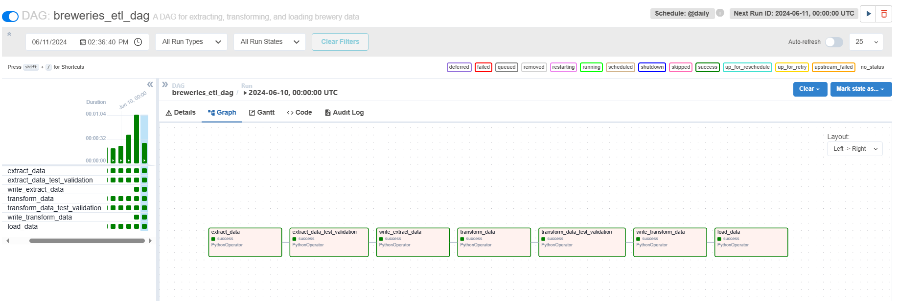

# ETL Data Pipeline for Breweries Data

### Readme em português esta aqui: [README-PT](README-PT.md)

## Description
 1. This project extracts breweries data from API endpoint <https://api.openbrewerydb.org/breweries>
 2. Transforms, cleans the data, persists the data in json and parquet formats, including aggregated view with  quantity of breweries per type and location.
 3. Loads data into Postgres Database for further querying capabilities. 

## Setup

### Environment Variables

1. Set the AWS Keys environment variables for in the docker-compose files to write data to S3 Storage.
2. Define S3 Bucket location Path to write datalake files to
**(Optional)**

__If not defined it will still write data locally in container, but skip over data write to S3 Cloud storage.__

### Prerequisites
- Git
- Docker
- Docker Compose

### Steps to Run

1. Clone the repository:
    ```bash
    git clone https://github.com/vitorjpc10/etl-breweries.git
    ```
2. Move to the newly cloned repository:
    ```bash
    cd etl-breweries
    ```

### ETL without Orchestrator (Python Docker Image)

3. Build and run the Docker containers:
    ```bash
    docker-compose up --build
    ```

4. The data will be extracted, transformed, and loaded into the PostgreSQL database based on the logic in `scripts/main.py`.

5. Once built, run the following command to execute queries on both weather and traffic tables from PostgreSQL database container:
    ```bash
    docker exec -it etl-breweries-db-1 psql -U postgres -c "\i queries/queries.sql"
    ```

   Do `\q` in terminal to quit query, there are 2 queries in total.

### ETL with Orchestrator (Apache Airflow)

4. Move to the Airflow directory:
    ```bash
    cd airflow
    ```

5. Build and run the Docker containers:
    ```bash
    docker-compose up airflow-init --build
    ```
   ```bash
    docker-compose up
    ```

6. Once all containers are built access local (http://localhost:8080/) and trigger etl_dag DAG (username and password are admin by default)

7. Once DAG compiles successfully, run the following command to execute queries on both weather and traffic tables:
    ```bash
    docker exec -it airflow-postgres-1 psql -U airflow -c "\i queries/queries.sql"
    ```
   Do `\q` in terminal to quit query, there are 2 queries in total.


## Assumptions and Design Decisions
- The project uses Docker and Docker Compose for containerization and orchestration to ensure consistent development and deployment environments.
- Docker volumes are utilized to persist PostgreSQL data, ensuring that the data remains intact even if the containers are stopped or removed.
- The PostgreSQL database is selected for data storage due to its reliability, scalability, and support for SQL queries.
- Pure Python, SQL, and PySpark are used for data manipulation to ensure lightweight and efficient data processing.
- The SQL queries for generating reports are stored in separate files (e.g., `queries.sql`). This allows for easy modification of the queries and provides a convenient way to preview the results.
- To generate the reports, the SQL queries are executed within the PostgreSQL database container. This approach simplifies the process and ensures that the queries can be easily run and modified as needed.
- The extracted data is saved locally ('data' folders) and AWS S3 (Optional) and mounted to the containers, including the raw data coming from the API and the transformed, both in JSON and Parquet format. This setup offers simplicity (KISS principle) and flexibility, allowing for easy access to the data.
- An aggregate view with the quantity of breweries per type and location is created to provide insights into the data.
- Orchestration through Apache Airflow ensures task separation and establishes a framework for executing and monitoring the ETL process. It provides notification alerts for retries or task failures, enhancing the robustness of the pipeline.


## Airflow Sample DAG


## AWS S3 File Write Preview


